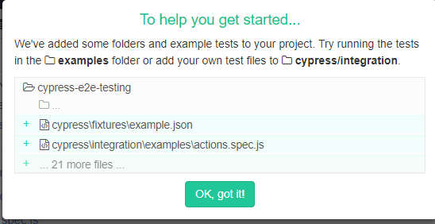

# Cypress e2e Testing

This project was generated with [Angular CLI](https://github.com/angular/angular-cli) version 8.3.3.

Learn how to perform amazing end-to-end testing for Angular Firebase apps using Cypress.io.

- <https://www.youtube.com/watch?v=7N63cMKosIE>
- You'll never write e2e tests in Angular 6 the same again <https://angularfirebase.com/lessons/cypress-angular-testing-end-to-end/>
- Why Cypress <https://docs.cypress.io/api/api/table-of-contents.html>
- [Realizing quality improvement through test driven development: results and experiences of four industrial teams](https://link.springer.com/article/10.1007%2Fs10664-008-9062-z)


## Content

1. [Testing Services with Http in Angular](./doc/testing-services-with-http-in-angular)

### Development server

Run `ng serve` for a dev server. Navigate to `http://localhost:4200/`. The app will automatically reload if you change any of the source files.

## Code scaffolding

1. Generate angular project

   ```bash
   ng new --minimal=true --directory=./
   npm install --save-dev cypress
   npm install --save-dev chance
   ```

   1. [cypress - ](https://docs.cypress.io/api/api/table-of-contents.html)
   1. [Chance generator](https://chancejs.com/)

1. Edit `package.json`

  ```json
  {
    "scripts": {
      "e2e": "cypress open"
    },
  }
  ```

1. Run cypress

  ```bash
  npm run e2e
  ```

1. After cypress run

> *Fig. 1: After cypress run*


1. [Mocha](https://mochajs.org/) - JavaScript test framework 


## Description

Cypress is an end-to-end testing library.
